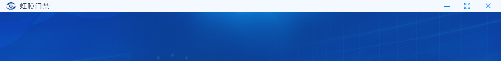

## 引言

本文介绍如何基于 electron+vue 实现自定义的窗口最大化、最小化和关闭按钮，以实现自定义的样式。

## 关闭原始按钮

在 background.js 中创建窗口的时候设置如 frame 为 false，关闭原始按钮边框

```js
const win = new BrowserWindow({
    width: 1200,
    height: 800,
    frame: false,
});
```

## 自定义按钮和窗口

-   封装一个自定义按钮组件

```js
<template>
    <div
        class="titlebtn"
        :style="style"
        @click="click"
        v-html="btnContent"
    ></div>
</template>

<script>
// const { ipcRenderer: ipc } = require('electron') //不能在renderer中直接引用node的组件
const ipcRenderer = window.electronAPI //通过window来传递

const style = {
    min: {
        backgroundColor: '#f4f9ff',
        right: '110px',
    },
    max: {
        backgroundColor: '#f4f9ff',
        right: '60px',
    },
    close: {
        backgroundColor: '#f4f9ff',
        right: '10px',
    },
}
var btn = {
    min: '----',
    max: '',
    close: '',
}
export default {
    name: 'TitleButton',
    props: ['type'],
    data() {
        return { btnContent: '' }
    },
    mounted() {
        this.getBtn()
    },
    created() {},
    computed: {
        style: function () {
            return style[this.type]
        },
    },
    methods: {
        getBtn: function () {
            this.btnContent = btn[this.type]
        },
        click: async function () {
            const isMaxed = await ipcRenderer.titleBtnClick(this.type)
            if (isMaxed === 1) {
                btn.max =
                    ''
                this.getBtn()
            } else if (isMaxed === 0) {
                btn.max =
                    ''
                this.getBtn()
            }
        },
    },
}
</script>

<style lang="scss" scoped>
.titlebtn {
    width: 40px;
    height: 30px;
    position: absolute;
    font-size: 16px;
    line-height: 30px;
    letter-spacing: -2px;
    color: #007eff;
    display: flex;
    align-items: center;
    justify-content: center;
    -webkit-app-region: no-drag; //禁止窗口按钮拖动
}
.titlebtn:hover {
    border: 1px solid rgba(255, 255, 255, 0.3);
}
</style>
```

-   封装一个自定义边框，引入上面的按钮，放在右上角

```js
<template>
    <div class="myTitle">
        <div class="leftWrap">
            
            <span>虹膜门禁</span>
        </div>
        <div class="rightWrap">
            <title-button type="min"></title-button>
            <title-button type="max"></title-button>
            <title-button type="close"></title-button>
        </div>
    </div>
</template>

<script>
import TitleButton from './TitleButton.vue'

export default {
    name: 'myTitle',
    components: {
        TitleButton,
    },
}
</script>

<style lang="scss" scoped>
.myTitle {
    display: flex;
    justify-content: space-between;
    width: 100%;
    height: 30px;
    background-color: #f4f9ff;
    -webkit-app-region: drag; //无框窗口可拖动
    .leftWrap {
        display: flex;
        align-items: center;
        margin-left: 5px;
        .icon {
            height: 18px;
            margin: 0 10px;
        }
        span {
            font-size: 16px;
            line-height: 18px;
            letter-spacing: 2px;
        }
    }
    .rightWrap {
        display: flex;
        align-items: flex-end;
        position: relative;
    }
}
</style>
```

## 通过主进程实现按钮功能

上面的步骤已经实现了自定义窗口边框和按钮的外观，现在就需要使用 ipc 进行渲染进程和主进程之间的通信以实现按钮的功能。

-   在渲染页面的预加载文件 preload.js 中引入 ipcrenderer，并创建调用函数，实现从渲染进程与主进程的通信。

> 根据 electron 官方文档（https://www.electronjs.org/zh/docs/latest/tutorial/ipc )， 两进程之间的 ipc 通信是通过开发者自定义的 channel(通道)，根据使用场景的不同，主要有单向(ipc.send,ipc.on)、双向(ipc.invoke,ipc.handle)两种，后者主进程接收到信息之后还可以向渲染进程返回信息。

为了根据返回的窗口状态切换自定义最大化按钮的图标，我们选择后者，在渲染进程使用 ipc.invoke 发消息,在主进程使用 ipc.handle 处理并返回窗口的状态。

**preload.js:**

```js
const { contextBridge, ipcRenderer } = require("electron");

contextBridge.exposeInMainWorld("electronAPI", {
    titleBtnClick: (type) => ipcRenderer.invoke("title-channel", type),
});
```

**在渲染进程中调用 ipcrenderer 函数:**

```js
const isMaxed = await ipcRenderer.titleBtnClick(this.type);
```

**在主进程处理:**

```js
//监听title-channel通道，处理自定义窗口按钮
ipcMain.handle("title-channel", handleTitle);

//回调，处理最小化、最大化、关闭按钮
async function handleTitle(event, type) {
    switch (type) {
        case "min":
            await win.minimize();
            return 2;
        case "max":
            if (win.isMaximized()) {
                await win.restore();
                return 0;
            } else {
                await win.maximize();
                return 1;
            }
        case "close":
            await win.close();
            return 3;
        default:
            break;
    }
}
```

## 实现效果




### Reference

https://blog.csdn.net/catgray/article/details/95523443
